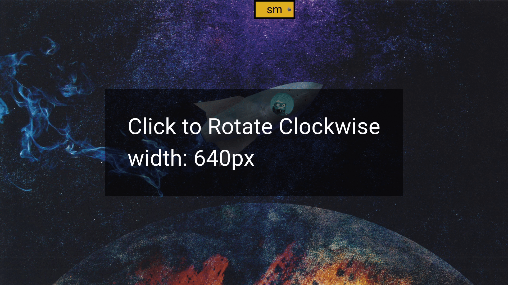
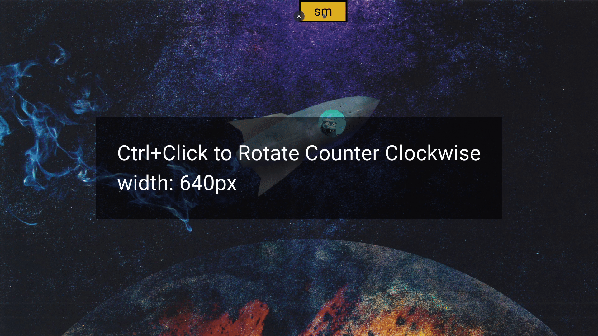

# Material-UI Breakpoint Helper

<div style="
  display: flex;
  background: url('media/ziltoid.jpg');
  padding: 1em;
  justify-content: space-between;
">
  
  
  
  
  
</div>


When developing responsive applications with material-ui, it's often helpful to be able to easily visualize the current breakpoint.  Enter, `<BreakpointHelper />`.

## How does it work?

You can simply import the component at the top level of your app, _just_ after `material-ui`'s `ThemeProvider` (shown below with `redux` as well):

```tsx
import React from 'react';
import ReactDOM from 'react-dom';
import CssBaseline from '@material-ui/core/CssBaseline';
import { ThemeProvider } from '@material-ui/core/styles';
import { theme } from './path/to/my/theme';
import { MyApp } from './path/to/MyApp';
import { configureStore } from './store/configureStore';
import { Provider } from 'react-redux';
import { BreakpointHelper } from 'mui-breakpoint-helper';

const store = configureStore();

ReactDOM.render(
  <Provider store={store}>
    <ThemeProvider theme={theme}>
      <CSSBaseline />
      <BreakpointHelper />
      <MyApp />
    </ThemeProvider>
  </Provider>,
  document.querySelector('#root'),
);
```

## How can it be configured?

### the `position` prop [string, defaults to `top-center`]

The `BreakpointHelper` has an optional `position` prop with the following type:

```ts
type Position =
  | 'bottom-center'
  | 'bottom-left'
  | 'bottom-right'
  | 'left-center'
  | 'right-center'
  | 'top-center'
  | 'top-left'
  | 'top-right'
  ;
```

The default is `top-center`, but you can configure the default to whatever position you prefer, e.g.:
```tsx
<BreakpointHelper position="bottom-right" />
```

### the `visible` prop [boolean, defaults to `true`]

A common use case is to use a tool like this conditionally, e.g.:

```tsx
const debugMode = useSelector(selectDebugMode);

return (
  <div>
    {debugMode && <BreakpointHelper />}
    <MyApp />
  <div>
)
```

While you can still do the above, `BreakpointHelper` accepts a `visible` prop (defaults to `true`) where you can pass a debugMode flag, as above:

```tsx
const debugMode = useSelector(selectDebugMode);

return (
  <div>
    <BreakpointHelper debugMode={debugMode} />
    <MyApp />
  <div>
)
```

The implementation of the `visible` prop is such that passing `visible={false}` is a no-op.

## How can it be interacted with?

### Resize the Viewport

Simply resize the viewport, and watch the indicator change:


### Click to Rotate

#### Clockwise
You can click on the helper to temporarily rotate it to the next position, clockwise.


#### Counter-Clockwise
You can ctrl+click the helper to rotate it counter-clockwise.


> **NOTE:** When you refresh or rerender your app it will revert to whatever the `position` prop is set to (or the default, `top-center` if none is set), so be sure to just set the `position` prop if you want it to always be in a particular area of the screen.

## Can I use this if I'm not using Material-UI?

No.  At this time, this component is directly tied to some material-ui underpinnings.
